# Rejecting AI’s “Mediocre Correctness”: I Built a Self-Evolving Agent Based on Reverse Auditing and Game-Theoretic Reasoning

0. [Introduction](#0-introduction)
0. [From “Human Experience” to “Machine Intelligence”: Practical Reflections on Reconfiguring the Configuration Process](#1-from-human-experience-to-machine-intelligence-practical-reflections-on-reconfiguring-the-configuration-process)
0. [Architecture Evolution: Building an Agent System with a Dual‑Asynchronous Closed Loop](#2-architecture-evolution-building-an-agent-system-with-a-dualasynchronous-closed-loop)
0. [Breaking the “Impossible Trinity”: From Serial Coupling to Semantic Protocol Restructuring](#3-breaking-the-impossible-trinity-from-serial-coupling-to-semantic-protocol-restructuring)
0. [Crossing the “Probability Gap”: How Multi‑Agent Debate Ends Configuration Hallucinations](#4-crossing-the-probability-gap-how-multiagent-debate-ends-configuration-hallucinations)
0. [Breaking the “Correction‑Repetition” Cycle: Building a Self‑Reflective Knowledge Evolution System](#5-breaking-the-correctionrepetition-cycle-building-a-selfreflective-knowledge-evolution-system)
0. [Noise Suppression and Trust Assessment for Imperfect Feedback](#6-noise-suppression-and-trust-assessment-for-imperfect-feedback)
0. [Reference](#7-reference)

## 0. Introduction
When deploying large language models (LLMs) in industrial-grade scenarios—such as system backend parameter configuration and complex logic modeling—I encountered a core contradiction that is difficult to avoid: the inherent probabilistic randomness of the models versus the absolute determinism required by industrial operations.

Practice has repeatedly shown that no matter how complex the constraints or structured prompt engineering we introduce, the output remains at risk of deviating from expectations due to the underlying probabilistic decoding mechanism. In production environments, this uncontrollable “model hallucination” often manifests as a form of “mediocre correctness”—the output is logically coherent and delivered with a sincere tone, yet it is filled with vague “it depends” caveats, or gives seemingly reasonable but actually wrong suggestions at critical logical nodes.

For content creation, this kind of “smoothness” might be acceptable. But for system configuration and core decision-making, a “highly probable correct” suggestion often means the potential for a production incident; an ambiguous response simply passes the risk back to the human engineer. In this context, traditional “parameter tuning” and “prompt optimization” have hit a ceiling—we cannot trade probability for determinism.

Is the ultimate destiny of AI agents in industrial scenarios to become overly cautious, hedging “yes-men”?

Clearly not. True industrial-grade intelligence should not stop at “avoiding mistakes”; it should dare to find optimal solutions through rigorous logical reasoning under uncertainty, and possess the ability to self-evolve based on feedback.

To bridge this gap, I chose not to blindly stack larger model parameters. Instead, I started from the underlying architecture and built a “multi-dimensional self-evolving agent.”

In this system, I introduced an “adversarial game mechanism” to break the blind spots of a single perspective, designed a “reverse auditing logic” to anchor the rigidity of rules, and established a dynamic confidence scoring system. As a result, the system is no longer a static probability generator, but an organism capable of iterating upon itself with every piece of user feedback and logic validation—constantly moving closer to “absolute certainty.”

## 1. From “Human Experience” to “Machine Intelligence”: Practical Reflections on Reconfiguring the Configuration Process

During the implementation of enterprise-level systems, backend parameter configuration often becomes the “last mile” before going live, yet it is also the link most prone to becoming a bottleneck. Minor deviations in configuration can lead to severe business failures, and the current model—which relies purely on human experience—exposes clear limitations across different tiers of teams:

- **Junior users: high barriers and high trial‑and‑error costs**  
  Faced with complex configuration models and missing systematic documentation, new members often struggle through a long learning curve. Since core logic frequently resides in unstructured verbal guidance and there is a lack of immediate feedback mechanisms, newcomers find it difficult to independently ensure configuration accuracy, resulting in costly trial and error.

- **Senior users: inefficient repetition crowding out core value**  
  Even seasoned experts must devote a significant amount of energy to the standardised process of “reading documentation → logging into the platform → manually setting items one by one.” This deterministic, repetitive work severely consumes the time that should be spent on high‑value activities such as architecture optimisation and strategic decision‑making.

- **Organisational assets: the risk of losing tacit knowledge**  
  A large amount of “best practices” and “pitfall avoidance guides” is scattered across personal experience, making it hard to structure and preserve. When personnel leave, this tacit knowledge leaves with them, directly causing a decline in configuration consistency across teams and a break in organisational memory.

### 1.1. Design Goal: Building a High‑Precision Configuration Assistance Agent

To address the above pain points, I attempted to design an LLM‑based AI agent system that seeks a balance between probabilistic models and deterministic business operations. The system focuses on three core objectives:

1. **Traceability**  
   Instead of providing only the final result, the system outputs structured configuration recommendations along with the reasoning chain. This not only significantly lowers the cognitive barrier for junior users but also ensures that every configuration decision can be traced and verified.

2. **Automation**  
   Achieve a direct mapping from “natural language requirements” to “concrete configuration solutions.” By handing over clearly defined operational tasks to the agent, human effort can be redirected toward high‑value analysis and decision‑making.

3. **Knowledge Capitalisation**  
   Leverage the powerful summarisation capabilities of LLMs to automatically transform scattered personal experiences into a reusable, iterable standardised knowledge base, thereby creating an organisational “knowledge flywheel.”

> What I aim to build is not merely a productivity tool, but a system component that combines high accuracy with robust logical safeguarding. In complex business scenarios, how to enable AI to truly understand and strictly adhere to business logic will be the focus of my ongoing technical review and exploration.

## 2. Architecture Evolution: Building an Agent System with a Dual‑Asynchronous Closed Loop

When resolving the contradiction between “probabilistic models” and “deterministic operations,” I chose not to rely solely on prompt engineering. Instead, I approached it from a system architecture perspective and designed a **dual‑asynchronous closed‑loop** architecture.

The core idea behind this architecture is spatiotemporal decoupling: separating time‑consuming knowledge evolution from real‑time reasoning and decision‑making, reducing online load through offline distillation, and ensuring knowledge purity through posterior auditing.



The entire system consists of three core layers, forming a self‑evolving closed loop.

### 2.1. Offline Periodic Layer: The “Distillery” of Knowledge

**Purpose:** Backend knowledge evolution engine, completely transparent to users.

**Design rationale:** The context window of an LLM is both expensive and limited. Feeding massive amounts of documentation directly to the online model is neither economical nor efficient. I chose to let a `Research Agent` run on a weekly cadence to perform “deep modeling” tasks:

1. **Relationship topology construction:** Automatically analyze SRS documents and historical snapshots to build a multi‑dimensional semantic graph of resource IDs and constraints, uncovering implicit dependency conflicts.
2. **Knowledge distillation:** Compress unstructured text into a high‑density, structured knowledge base (KB).

> **Engineering benefit:** Measurements show that this strategy reduces end‑to‑end inference latency by over 70%, significantly lowers token consumption, and achieves extreme cost‑efficiency in system operation.

### 2.2. Online Runtime Layer: The “Decision Hub” in a Game‑Theoretic Setting

**Purpose:** Dynamic decision engine that handles user requests at millisecond scale.

**Design rationale:** A single model is prone to hallucinations. To balance speed and accuracy in real‑time scenarios, I introduced a multi‑agent debate mechanism:

- **Analyzer:** Generates an initial proposal based on the offline knowledge base.
- **Critic:** Actively challenges the proposal, identifying logical flaws and potential conflicts.
- **Advocate:** Provides justifications for the feasibility of the proposal.
- **Rationalist:** Synthesizes multiple perspectives and converges on a logically consistent final output, accompanied by a confidence score.

> **Engineering benefit:** Through the adversarial process of “challenge – defense – consensus,” semantic hallucinations are effectively suppressed, ensuring that the output not only complies with explicit rules but is also practically implementable.

### 2.3. Posterior Evolution Layer: The “Filter” for Reverse Auditing

**Purpose:** An experience‑induction center that asynchronously drives system evolution.

**Design rationale:** How can we make the system “smarter with use” without being contaminated by erroneous data? I designed **inverse auditing logic**:

- **Rule‑anchor verification:** The SRS documentation serves as the absolute authority. Only when a user’s actual modification can be verified by reverse‑inferring the documented logic will the `Review Agent` recognize it as “valid experience” and persist it.
- **Anomaly marking:** Operations that cannot be logically reverse‑inferred are flagged as “user misoperation” or “special exception,” preventing contamination of the knowledge base.

> **Engineering benefit:** A strict “practice → audit → induction → feedback” closed loop is formed, ensuring that the knowledge system evolves in the right direction with each iteration.

### 2.4. Architecture Retrospective

The original intention behind this architecture was to seek a balance between the flexibility of LLMs and the rigor of industrial systems.

- The offline layer addresses the “whether it understands” aspect (knowledge breadth);
- The online layer addresses the “whether it is accurate” aspect (reasoning depth);
- The audit layer addresses the “whether it is trustworthy” aspect (data purity).

## 3. Breaking the “Impossible Trinity”: From Serial Coupling to Semantic Protocol Restructuring

In the early iterations of the system, I fell into a typical architectural pitfall: forcibly coupling Research (knowledge acquisition) and Execution (decision‑making reasoning) within the same real‑time invocation chain. This serial model directly led the system into an “impossible trinity” dilemma among response latency, resource cost, and operational stability:

### 3.1. Three Major Bottlenecks of the Early Architecture

1. **Latency Hell**  
   Parsing tens of thousands of words of SRS documentation in real time resulted in extremely high end‑to‑end latency. Users frequently found themselves trapped in a vicious cycle of “wait → timeout → retry,” resulting in a poor experience.

2. **Token Waste**  
   The core pain point was the ineffective repetition of computational logic. Under the serial architecture, every user request forced the model to re‑execute the entire cognitive process from scratch: parsing the static SRS documentation anew, and re‑deriving the complex relational model between it and the configuration data.  
   
   This meant that regardless of how the requirement varied, the system repeatedly consumed expensive tokens to reconstruct what should have been a constant “static knowledge graph.” This “analyze‑per‑request” pattern caused computing costs to grow linearly or even exponentially with concurrency, not only generating significant waste but also easily hitting the LLM API’s rate limits—becoming a hard bottleneck for system scalability.

3. **Fragility**  
   Long contexts significantly amplified the probability of model hallucinations, and often triggered server‑side truncation due to excessive input length, making it difficult to trace and debug error chains.

### 3.2. Root Cause Analysis

The core issue was a misalignment of responsibilities: I had previously tasked the online service with bearing a “heavy cognitive load” that should have been handled by an offline system. The real‑time path should focus on “decision‑making,” not “knowledge discovery.”

#### 3.2.1. Solution 1: Spatiotemporal Decoupling and Knowledge Distillation

To break the deadlock, I refactored the architecture, isolating the `Research Agent` as an independently scheduled periodic background task and implementing offline knowledge distillation:

1. **Asynchronous modeling:** Asynchronously fuse multi‑source heterogeneous data (documents, historical configurations, logs) in the background without blocking user requests.
2. **Structured output:** “Compress” unstructured, lengthy documents into lightweight assets that machines can directly consume:
   - **Mapping topology:** Automatically construct strong associations between resource IDs and configuration items.
   - **Dependency graph:** Precisely capture logical dependencies and potential conflicts among constraints.
   - **Rule templates:** Codify common configuration paradigms within the domain.

> This transformation fundamentally removed the knowledge discovery burden from the online phase, allowing real‑time reasoning to focus solely on “applying knowledge” rather than “searching for knowledge.”

#### 3.2.2. Solution 2: Building an “AI‑Native Semantic Protocol”

Building on decoupling, to pursue extreme reasoning efficiency, I further introduced a new knowledge representation paradigm: having the model output what it understands best.

During the offline distillation phase, the `Research Agent` no longer generates simple natural‑language summaries. Instead, it actively restructures knowledge into an intermediate format that is **syntactically compact, logically explicit, and symbolically enhanced**—what we call an **AI‑Native Semantic Protocol**.

- **High Semantic Density**  
  This protocol prioritizes efficient parsing by the `Execute Agent`. Through patterned symbolic enhancements (e.g., specific logical markers, structured key‑value pairs), it significantly increases the information density per token, substantially reducing redundant computation during reasoning.

- **Observability Anchors**  
  While pursuing machine efficiency, the protocol retains plain‑text descriptions and source anchors for key fields. This ensures that human experts can still effectively review, attribute, and debug when necessary, avoiding the risk of a “black box.”

> This essentially builds a “Classical Chinese protocol” for AI‑internal communication: sacrificing some degree of direct human readability in exchange for extreme parsing efficiency and logical accuracy from the machine. Practice has shown that this strategy not only makes the system “run faster,” but also ensures that logic “runs more accurately.”

## 4. Crossing the “Probability Gap”: How Multi‑Agent Debate Ends Configuration Hallucinations

In enterprise configuration scenarios, logical certainty is the lifeline. Yet when we attempt to use LLMs—which generate outputs probabilistically—to handle highly dependent, multi‑level SRS documents, the traditional single‑agent architecture reveals its fundamental limitation: trying to perform “deterministic tasks” with “probabilistic guesses.”

### 4.1. Three Major Risks of a Single‑Model Architecture

1. **Path Instability of Reasoning**  
   Even with identical inputs, slight changes in decoding parameters can cause the reasoning path to shift significantly. The same document may produce logically contradictory configuration proposals in different requests, making practical engineering implementation impossible.

2. **Chain Amplification of Semantic Hallucinations**  
   During long‑chain reasoning, the model is highly prone to fatal errors—misreferencing undefined fields, fabricating dependency relationships, or quietly omitting critical exclusion conditions. Under a single‑agent architecture, such hallucinations lack internal verification and often reach the user directly.

   ```java
   // Real‑world example of a fabricated hallucination
   /**
    * Scenario: Configuration of a display‑only component.
    * SRS description: “If data loading fails, a rollback process should be triggered;
    * if successful, proceed to the next step (next-func).”
    * Actual constraint: The component is purely static; its configuration file
    * contains only data key‑value pairs, and must never include any function calls
    * or logic control fields.
    */
   // Original configuration
   {
       "key-1": "value-1",
       "key-2": "value-2"
   }
   
   // Single‑agent hallucination output: the model invents execution logic
   // based on the descriptive text in the SRS
   {
       "key-1": "value-1",
       "function": {
           "rollback": "function-name",
           "next-func": "function-name"
       }
   }
   
   // The model confuses “rule description” with “configuration payload”.
   // Because the document mentions “rollback” and “next step,” it assumes
   // corresponding fields must exist in the configuration.
   // Under a single‑agent architecture, this seemingly reasonable but
   // invalid output would be directly accepted,
   // causing the rendering engine to error out due to unrecognized
   // “function” fields, or triggering uncontrollable side effects.
   ```

3. **Non‑deterministic Audit Black Box**  
   The absence of internal verification mechanisms makes conclusions extremely fragile—even a punctuation change in the prompt can sway the final decision. This prevents us from establishing a trustworthy audit chain, violating the compliance requirements of enterprise‑grade systems.

#### 4.1.1 Core Contradiction  
When a single model acts as both the “athlete” and the “referee,” a closed environment lacking checks and balances cannot spontaneously converge probabilistic generation toward deterministic logical truth.

### 4.2. Solution: Building a “Four‑in‑One” Dynamic Debate Framework

To overcome cognitive limitations, I designed a **Multi‑Agent Debate Framework** inspired by human expert review panels. Through role specialization and adversarial verification, the framework pushes AI outputs from “probabilistic guesses” toward “logical justification.”

#### 4.2.1 Collaborative Reasoning with Four Roles
This simulates the “challenge → defense → adjudication” process of real engineering reviews, achieving a shift from single‑point judgment to collective rationality:

- **Analyzer:** The initial proposal generator. Builds the initial reasoning chain based on the offline distilled knowledge base, establishes the logical starting point, and is responsible for “proposing hypotheses.”
- **Critic:** The vulnerability detection expert. Actively conducts stress testing, focusing on boundary exceptions, hidden conflicts, and logical flaws—responsible for “falsifying.”
- **Advocate:** The compliance defender. Supplies complementary positive evidence to prevent the system from being overly conservative and discarding viable proposals—responsible for “verifying.”
- **Rationalist:** The chief arbitrator. Performs causal back‑reasoning and semantic alignment across multiple perspectives, closes the logical loop, ensures consistency, and outputs the final consensus—responsible for “adjudicating.”

#### 4.2.2 Centralized Orchestration via a Master Agent
A lightweight Master Agent acts as the process scheduler. It does not generate opinions but plays the role of a “cognitive supervisor”:

- **Global orchestration:** Manages the pace of information exchange, triggering role interactions in sequence to avoid ineffective dead loops.
- **Reasoning chain aggregation:** Records the evidence behind each round of debate, ensuring full traceability of the decision process.
- **Hallucination filter:** Compares the consistency of entities referenced and rules cited across agents, automatically identifying and discarding assertions that lack external anchors.

#### 4.2.3 Task‑Oriented Vertical Adaptation
This is not a simple stacking of generic conversational assistants, but a highly constrained, task‑specific vertical system:

- **Pixel‑level prompt tuning:** Fine‑grained modeling of configuration syntax rules and dependency topology, ensuring each role’s persona remains tightly focused.
- **Targeted capability accumulation:** The behavioral patterns of each agent are refined through extensive feedback from historical mis‑judgments, giving them domain‑specific “intuition.”
- **Strict output format:** Enforce structured JSON + rationale output. Not only the result, but also the reasoning process is provided, offering a standardized interface for subsequent automated verification.

> Although this mechanism increases computational cost per inference, it yields orders‑of‑magnitude improvements in logical accuracy and explainability. In high‑risk configuration scenarios, this is the optimal way to trade compute for “certainty.”

## 5. Breaking the “Correction‑Repetition” Cycle: Building a Self‑Reflective Knowledge Evolution System

During the early testing phase of system development, I observed a frustrating phenomenon: user feedback did not make the model smarter.

Even after a user manually corrected a certain erroneous configuration, the model would repeat the same mistake the next time it encountered a similar scenario. This revealed a fundamental bottleneck of traditional RAG (Retrieval‑Augmented Generation) or fine‑tuning approaches.

### 5.1. Challenge: Shallow Feedback and Inferential Inertia

1. **Feedback Signals Do Not Reach the Underlying Logic (Surface‑Level Feedback)**  
   Traditional user feedback is often only a local correction to the result (e.g., “change this field from A to B”). Such signals only affect the “surface output” and do not touch the reasoning process. Due to the lack of structured attribution, the AI cannot identify flaws in its own reasoning chain and will still follow the same erroneous path in similar scenarios.  
   <br> *“You only tell it it’s wrong, but not why it’s wrong. Next time it will still guess incorrectly based on intuition.”*

2. **Logical Inertia in the Reasoning Chain**  
   Large language models tend to rely on probabilistic preferences formed during pre‑training, creating stable “cognitive blind spots.” A single conversational correction is often insufficient to break such deep‑seated cognitive entrenchment. The model stubbornly assumes: “Last time I derived it this way. Although the result was corrected, my logic was most likely correct,” causing similar errors to recur repeatedly.

3. **Experience Silos Across Multiple Users**  
   In a stateless session architecture, interactions between different users are completely isolated.  
   - **Phenomenon:** User A spends half an hour correcting a complex configuration error and provides the correct logical explanation. Yet when User B encounters the exact same scenario, the model still generates the incorrect answer that User A had already disproved.  
   - **Consequence:** The system cannot achieve “one user’s pitfall becomes everyone’s immunity.” Every new user forces the system to go through the same “error → correction” process. Valuable correction data dissipates when the session ends and cannot be distilled into collective wisdom. This prevents the overall error rate from naturally decreasing as user volume increases, violating the “economies of scale” expected from an AI system.

### 5.2. Solution: Building an Attribution‑Driven Asynchronous Self‑Reflection System

To break the “correction‑repetition” cycle, I designed an **Asynchronous Self‑Reflection Architecture** that operates independently from the main business flow. It does not interfere with real‑time responses but instead conducts deep retrospectives in the background, achieving a shift from “passive response” to “active evolution.”

#### 5.2.1 Core Mechanism: Full Reasoning Trace Review

The system no longer stores only the final result, but persistently persists the complete “reasoning trace package” for every decision:

1. **Complete recording of the debate process:** Captures each round of interactions, points of contention, and compromises among the Analyzer, Critic, and Rationalist.
2. **Knowledge reference anchors:** Precisely traces the knowledge‑base basis behind each recommendation (e.g., was an outdated document cited? Or was an SRS clause misinterpreted?).
3. **User modification diffs:** Compares the AI’s recommendation with the final configuration adopted by the user.

#### 5.2.2 Deep Attribution Analysis by a Reflection Agent

An independently scheduled `Review Agent` periodically performs audit tasks, conducting systematic retrospectives from a “third‑party forensic” perspective:

1. **Root Cause Analysis:**  
   - Was it a comprehension error? (misinterpreting an SRS constraint)  
   - Was it a weighting imbalance? (overemphasizing performance at the cost of cost in multi‑factor trade‑offs)  
   - Or was it residual hallucination? (the Critic failed to intercept an erroneous assumption from the Analyzer)

2. **Success Pattern Mining:**  
   - From high‑confidence expert correction cases, reverse‑engineer missing dimensions in the system’s existing knowledge base, uncovering hidden judgment logic that was previously “known only implicitly.”

3. **Core Output: Dual Dynamic Knowledge Base**

> The attribution results are structurally distilled into two types of core knowledge assets that directly intervene in future debate processes, forming a “practical experience graph”:

| **Knowledge Base Type** | **Alias** | **Function Description** |
| :---: | :---: | --- |
| **Negative Logic Repository** | *Pitfall Guide* | Explicitly marks verified logical traps, conflict patterns, and invalid paths. |
| **Positive Logic Repository** | *Best‑Practice Guide* | Distills expert‑level configuration paradigms, key decision characteristics, and optimal solution templates. |

### 5.3. Value Loop: Secondary Distillation of the Knowledge Flywheel

These experiential insights do not exist in isolation; they are fed back to the `Research Agent` through periodic tasks. In each new round of knowledge distillation:

- **Reasoning basis evolves:** Shifts from purely “theoretical completeness” (what documents say) to “practically validated” (what experts actually do).
- **Rule expression evolves:** Transitions from static “clause descriptions” to dynamic “case‑driven” paradigms.

> Every user correction is no longer a simple “error fix,” but a form of “nourishment.”  
> By closing off old paths with the *Pitfall Guide* and opening new ones with the *Best‑Practice Guide*, the system truly achieves a knowledge loop that “gets smarter with use.”

### 5.4. Technical Retrospective: If It Can Evolve, Why Not Just Fine‑Tune the Model?

When building this evolution system, I faced a classic technical decision: should I directly apply SFT (supervised fine‑tuning) to the base model, or stick with the lightweight “retrieval‑augmented + dynamic knowledge base” path? After all, fine‑tuning is the most direct way to adapt a model to domain‑specific logic.

Ultimately, after a rigorous assessment of data assets, I abandoned the fine‑tuning approach.

1. **Hard Constraint of Data Scale: The Overfitting Trap with 100+ Data Points**  
   The current system has accumulated only 100+ data points. For a base model with a massive parameter count, this scale is far below the threshold for effective fine‑tuning (typically thousands to tens of thousands of samples).  
   
   The consequence of forced fine‑tuning: the model would be highly prone to catastrophic forgetting or severe overfitting. It would mechanically memorize the answers to these 100 cases without extracting generalizable logic. When faced with the 101st scenario—even one with slight variations—its performance would be worse than that of the non‑fine‑tuned base model.

2. **Iteration Efficiency Considerations**  
   The fine‑tuning pipeline: collect data → clean & annotate → train & validate → deploy. This is a heavy, long‑cycle process with a loop lasting weeks, making it difficult to accommodate frequent changes in business rules.  
   
   In contrast, the current model’s periodic tasks can quickly incorporate the latest practical data on a weekly basis.

#### 5.4.1 Conclusion: Replacing Parameter Updates with In‑Context Learning

In the early stages of data accumulation, an “external brain” (dynamic knowledge base) is far more efficient and safer than “retraining the cerebellum” (fine‑tuning).

The self‑reflection system I’ve built is precisely designed to maximize the value of these limited 100+ data points at minimal cost, enabling them to guide the system as effectively as thousands of data points would. This is not just an engineering compromise, but a return to the essence of Data‑Centric AI—letting wisdom emerge from flowing data, rather than being solidified in static parameters.

## 6. Noise Suppression and Trust Assessment for Imperfect Feedback

In the early design of the self‑evolution mechanism, I held an idealized assumption: “Every user correction is a step closer to the truth.” Consequently, the system initially adopted a “full acceptance” strategy, attempting to directly convert all user feedback into knowledge.

However, the complexity of real production environments soon delivered a harsh lesson. I discovered that unfiltered feedback not only failed to accelerate evolution but actually triggered “evolutionary drift.” Faced with this challenge, I had to re‑examine data quality and build a more prudent, tiered collaborative feedback auditing system.

### 6.1. Pain Point Reflection: When “Learning” Becomes “Contamination”

In real‑world scenarios, user feedback is not purely “correct answers”; it is a mixture of genuine corrections, operational errors, personal preferences, and even document misunderstandings. Incorporating such feedback indiscriminately would expose the system to three severe challenges:

1. **High Heterogeneity of Feedback Content**  
   Noise and signal coexist. Simple “majority voting” cannot distinguish between “collective cognitive blind spots” and “collective operational habits.” Blind absorption can easily pollute the underlying knowledge system.

2. **Risk of Logical Erosion in the Knowledge Base**  
   Once erroneous feedback is mistakenly treated as positive experience and written into the *Pitfall Guide*, the reasoning logic will systematically deviate. As iterations progress, the AI’s judgment will gradually depart from the “ground truth” defined by the SRS (Software Requirements Specification), forming a negative flywheel where “learning makes it worse.”

3. **Statistical Failure in Sparse Scenarios**  
   In long‑tail edge cases or the early stages of system deployment, samples for specific configuration paths are extremely limited. Traditional statistical denoising methods fail due to insufficient sample sizes, leaving the system without a basis for judgment at critical moments.

### 6.2. Technical Breakthrough: Building a Multi‑Dimensional Hierarchical Validation Framework

To strike an optimal balance between “broad absorption” (not missing any valuable tacit knowledge) and “precise purification” (strictly preventing noise contamination), I designed a four‑layer defense system that spans from macro‑level group behavior to micro‑level individual actions, and from explicit rules to implicit logic.

#### 6.2.1 Dimension 1: Consensus Filtering via Behavioral Consistency Analysis

> *Uncover “implicit norms” and filter out “accidental noise.”*

Instead of treating each correction in isolation, the system performs structured modeling of configuration behaviors across all users and clusters them in a high‑dimensional space based on scenario features (such as business type, structure, and parameter combinations).

- **Core Logic:**  
  When multiple independent users propose consistent and convergent modifications to the same field in similar contexts, the system recognizes this as a “consensus deviation.” This usually indicates a systemic flaw in the AI’s original reasoning logic that users have collectively corrected.
- **Value Insights:**  
  - **Uncover tacit knowledge:** Effectively discover “unwritten rules” or “best practices” that are not explicitly stated in documentation but are widely followed in practice.  
  - **Inherent noise resistance:** Accidental misoperations are naturally filtered out due to a lack of repeatability and consistency, requiring no manual intervention.

#### 6.2.2 Dimension 2: Dynamic Trust Scoring System

> *Enable “expert‑guided learning.”*

Since statistical quantity alone cannot be relied upon, I introduced a user‑level trust weighting mechanism to build an evolving **User Trust Profile**. Each user’s feedback is weighted by its trust score before entering the knowledge distillation process.

- **Core Metrics:**  
  - **Compliance match rate:** The degree to which historical feedback aligns with the official SRS documentation.  
  - **Logical self‑consistency:** Whether there are logical contradictions across multiple correction behaviors.  
  - **Revert rate:** Whether their modifications have been subsequently reversed (by themselves or others).
- **Operational Mechanism:**  
  Feedback from high‑trust users (e.g., senior architects) receives higher weight in knowledge distillation, while feedback from low‑trust users undergoes stricter review.
- **Value Insights:**  
  - **Quality weighting:** The system preferentially adopts practical experience from advanced users, preventing “bad money from driving out good.”  
  - **Adaptive evolution:** The trust model itself continuously improves with accumulated operational data, automatically identifying emerging experts.

#### 6.2.3 Dimension 3: Inverse Logic Audit for Single‑Sample Verification

> *Prevent “isolated cases from misleading the whole.”*

For low‑frequency or isolated feedback (e.g., a modification that appears only once), statistical methods are ineffective. Instead, the system initiates a refined logical review: using the user’s modified result as the endpoint, it reverse‑validates its reasonableness.

- **Compliance derivation:** Searches the existing knowledge base and SRS documentation for a theoretical basis supporting the modification.  
- **Conflict detection:** If the modification logically contradicts hard constraints, it is directly classified as “operational noise” and blocked.  
- **Suspect Tagging:** If the modification is logically self‑consistent but lacks precedent, it is neither immediately adopted nor discarded. Instead, it is tagged as **Suspect** and placed in an observation queue, pending further evidence (e.g., a second similar modification) before a decision is made.

**Value Insights:**  
Maintains basic judgment capabilities even under sparse sample conditions, ensuring that innovative best practices are not missed while preventing isolated errors from contaminating the global knowledge base.

#### 6.2.4 Dimension 4: Self‑Mirroring Calibration for Cold Start

> *Achieve “unsupervised proactive immunity.”*

During the “vacuum period” lacking real user feedback, I leveraged existing database configurations as **pseudo‑ground‑truth** to construct a simulated feedback channel.

**Execution Process:**
1. **Extract expected output:** Treat the stable configurations already running in the database as “correct answers.”
2. **Replay inference:** Drive the `Execute Agent` to re‑generate outputs for the same input conditions.
3. **Difference attribution:** Compare discrepancies between the “actual output” and the “existing configuration.” If inconsistencies are found, the `Review Agent` is forced to perform attribution analysis: is the model wrong, or is the existing configuration itself outdated?

**Value Insights:**
1. **Proactive problem detection:** Exposes common reasoning flaws before real users intervene.
2. **Zero‑shot cold start:** Achieves “unsupervised proactive immunity,” accelerating the system’s transition from cold start to stable evolution.
3. **Legacy activation:** Transforms dormant historical configuration data into valuable training signals.

## 7. Reference
1. Wang, Y., “Self-Instruct: Aligning Language Models with Self-Generated Instructions”
2. Hinton, G., Vinyals, O., and Dean, J., “Distilling the Knowledge in a Neural Network”
3. Xiong, K., Ding, X., Cao, Y., Liu, T., and Qin, B., “Examining Inter-Consistency of Large Language Models Collaboration: An In-depth Analysis via Debate”
4. Shinn, N., Cassano, F., Berman, E., Gopinath, A., Narasimhan, K., and Yao, S., “Reflexion: Language Agents with Verbal Reinforcement Learning”
